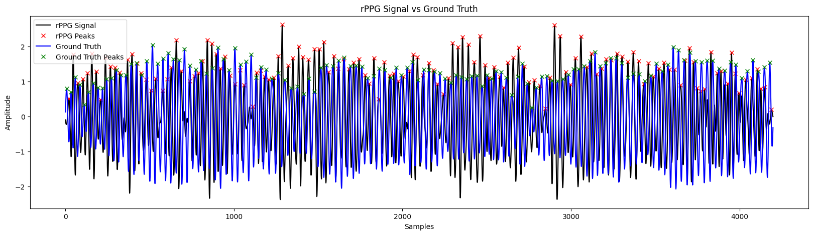
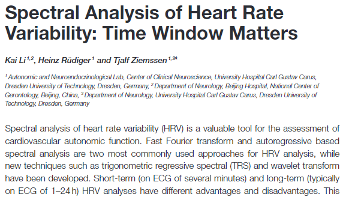
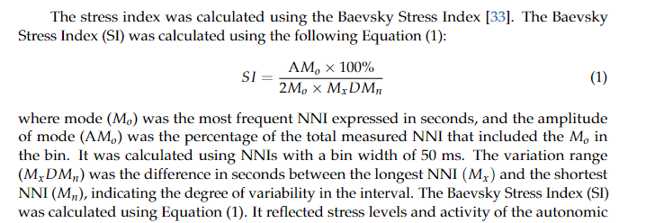

# Happy A New Year

I've a lot of QNA about this project.

### 1. Apakah sinyal RPPG and GT sudah sesuai untuk di proses lebih lanjut meskipun beda amplitudo

Disini saya menggunakan ROI mediapipe pada dua daerah (Pipi kiri dan kanan), mungkin ada sedikit gerakan kepala (seperti menoleh ke kiri / kanan yang menyebabkan tidak terdeteksi ROI-nya) tapi say asumsikan sepertinya untuk real-time tidak akan separah itu.

### 2. Time Window dalam HRV Analysis

Idealnya, dari artikel yang saya baca minimum waktu sampel yang diperlukan untuk analisis HRV adalah 2 menit, karena kalau kurang dari itu komponen frekuensi untuk LF / HF belum terbentuk sehingga sulit untuk melakukan Freq Domain Analysis.

Disisi lain, ada metode untuk mengukur indikasi stress oleh Roman M.Baevsky (Baevsky Stress Indicator) dengan formula ini.

Tapi ini jatuhnya kurang lebih estimasi.

Skema analisis HRV yang ada di kepala saya kurang lebih seperti ini:

1. Mengambil sinyal RPPG (Semakin banyak sampel semakin baik)
2. Preprocessing Sinyal (Filtering)
3. Mengabil nilai RR-Interval (jarak antara detak jantung dalam domain waktu) dan melakukan cleaning (memastikan rentang detak jantung antara 0.6 ms - 1.2 ms sebagai limit normal)
4. Setelah mendapatkan RR, maka dilakukan Time domain analysis (Mendapatkan Mean_RR, SDNN, RMSDD etc), semua bisa dilakukan oleh numpy.
5. Setelah itu dilakukan Freq Domain analysis, untuk mendapatkan nilai LF / FF dengan melakukan integrasi dengan PSD (Power Spectral Density) pada RR interval dan mendapatkan nilai dari LF dan HF untuk melakukan komputasi Rasio.
6. Melakukan stress detection pakai rule based berdasarkan nilai dari time / freq domain

#### Masalahnya

Menggunakan 2 menit time window lumayan lama untuk melakukan HRV analisis. untuk real time sepertinya cukup membosankan menunggu 2 menit, mesikpun saya sudah membuat 4 time widow dengan jarak setiap 30 detik.

Lalu untuk metode sendiri apakah sudah sesuai? Basis eksplorasi saya karena asumsikan informasi yang saya baca dari artikel / internet itu benar dan sok tau aja sih xd.

#### Next Chapter.

Selanjutnya, saya masih mengembangkan dashboard pake Kivy untuk GUI dari proses real-time nya nanti. In case dosen penguji minta kasus deployment setidaknya sudah ada ini. (Or Publish as VSCode Extension if possible xd).

Di satu sisi, saya menggunakan facial landmark ketimbang face detector untuk mendapatkan landmark yang reaktif dengan wajah pengguna untuk program RPPG, disisi lain mungkin bisa dilakukan training emotion menggunakan 420 landmark. Jadi tinggal menggunakan dataset wajah (senyum, murung, tertawa dll), ditetukan feature dan label ini, sehingga model akan belajar dari 420 nilai landmark dan menemukan kesamaan nilai pada target feature seperti senyum. Karena ini bukan deep learning melainkan cuman model training pada koordinat face landmark, seharusnya lebih cepat dan enteng ketimbang menggunakan deep learning.

### 3. Evaluasi

Karena program ini adalah real-time bagaimana cara mengukur evaluasinya, terutama pada deteksi stress?
